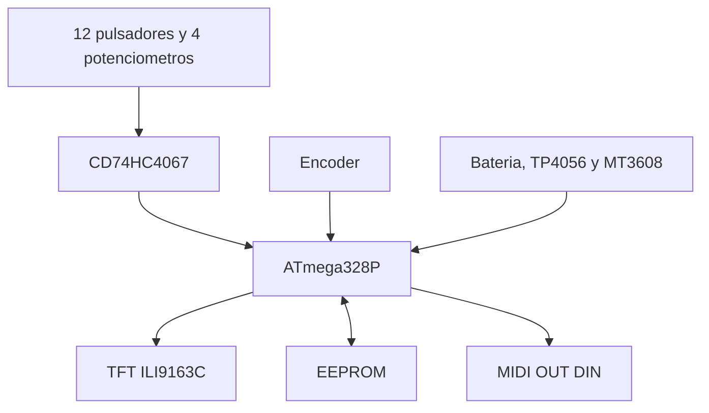

# Arquitectura del sistema

## Descripcion general

Nexo MIDI separa la adquisicion de controles, la interfaz, la persistencia y la
transmision MIDI mediante una maquina de estados. Los dieciseis controles
fisicos comparten la entrada analogica A0 mediante un CD74HC4067.

## Modos del firmware

- `PLAY`: transmite notas y mensajes CC.
- `MAIN_MENU`: acceso a presets, edicion y diagnostico de bateria.
- `PRESET_SELECT`: seleccion del preset activo.
- `PRESET_MANAGER`: crear, duplicar, restablecer o borrar.
- `PRESET_CONFIRM`: confirmacion de operaciones destructivas.
- `EDIT_GRID`: seleccion de potenciometro, pulsador, guardar o cancelar.
- `EDIT_DETAIL`: modificacion del mensaje y canal MIDI.

La edicion se realiza sobre una copia temporal. La opcion `X` descarta los
cambios y `V` los confirma y escribe en EEPROM.

## Datos persistentes

La EEPROM almacena una cabecera de identificacion, version del formato, preset
activo, mascara de presets existentes y ocho estructuras `Preset`. El primer
inicio habilita solamente el Preset 1. El sistema impide borrar el ultimo preset
existente.

## Flujo en modo PLAY

1. Se selecciona un canal del multiplexor.
2. Se descarta una primera conversion ADC despues de la conmutacion.
3. Los pulsadores pasan por antirrebote temporal.
4. Los potenciometros se filtran y cuantifican al intervalo MIDI 0-127.
5. Solo se transmite un CC cuando la variacion supera el umbral configurado.
6. La pantalla actualiza unicamente la region modificada para evitar parpadeo.

